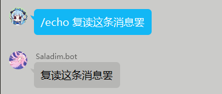

# 快速开始

## 配置环境

### go-cqhttp
go-cqhttp是一个基于 Mirai 以及 MiraiGo 的 OneBot Golang 原生实现, 
本框架使用它来接收来自qq的消息及调用响应api, 
截止2022-11-26, 测试使用的go-cqhttp版本为v1.0.0-rc3, 你可以在[Github Release](https://github.com/Mrs4s/go-cqhttp/releases/tag/v1.0.0-rc3)上下载它  

下载下来后, 使用命令行打开它, 会提示缺少配置文件, 此时按照需要选择通讯方式, 本框架目前只支持http协议和正向websocket协议, 所以请选择02

过后目录下会生成`config.yml`文件, 手动配置如下:

必须步骤:
- 在如下的位置的uin与password处填写bot号的账号与密码(或为空使用扫码登录)
```yml
account: # 账号相关
  uin: 1233456 # QQ账号
  password: '' # 密码为空时使用扫码登录
```
- 更改如下消息上报数据类型为`array`
message:
```yml
  post-format: array
```
- 更改并记住所需的http或websocket地址与端口如下(此时http通讯地址为`http://127.0.0.1:5700`,反向http地址为`http://127.0.0.1:5701`,正向websocket地址为`ws://127.0.0.1:8080`):
```yml
  - http: # HTTP 通信设置
      address: 127.0.0.1:5700 # HTTP监听地址

      post:           # 反向HTTP POST地址列表
      - url: http://127.0.0.1:5701/ # 地址

  # 正向WS设置
  - ws:
      # 正向WS服务器监听地址
      address: 127.0.0.1:8080

```

现在重新使用命令行打开, 进行所需的登录步骤, 此时跟随引导即可.
如果看到go-cqhttp内接收消息与bot qq号的同步那么说明配置完成.

### 引用本项目

这里推荐使用nuget包的方式, 首先打开本项目的`Saladim.QBot.sln`解决方案, 然后选择`SaladimQBot.GoCqHttp`项目进行编译打包. 获取包后安装到实例项目.

## 构建Client

本实例演示使用http通讯方式

首先创建一个CqClient抽象类的实例。
```c#
CqClient client = new CqWebSocketClient("ws://127.0.0.1:8080",LogLevel.Trace);
```
然后订阅OnLog事件和OnMessageReceived事件
```c#
client.OnMessageReceived += Client_OnMessageReceived;
client.OnLog += Console.WriteLine;

//函数签名如下:
private static void Client_OnMessageReceived(Message message)
```
然后异步开启该客户端
```c#
await client.StartAsync();
```
然后暂时阻塞
```c#
Console.ReadLine();
```
在阻塞完后记得关闭该client
```c#
await client.StopAsync();
```
现在我们启动程序, 应该会看到client输出日志
```log
[Info][Client/Connection] Connecting api session...
[Info][Client/Connection] Connecting post session...
```
如果之后没有报错信息显示或异常抛出那么说明程序与cq服务端连接成功

## 处理Message

在前面我们订阅了`OnMessageReceived`事件, 该事件会在cq服务端收到消息时发生, 现在我们来处理这个事件
首先我们获取该消息的带cq码的消息字符串,用户名,用户ID,并输出到控制台:
```c#
string rawString = message.MessageEntity.RawString;
long userId = message.Sender.UserId;
string nickName = message.Sender.Nickname.Value;
Console.WriteLine($"{nickName}({userId})说: {rawString}");
```
现在编译运行, 试试向bot所在的任何一个群里发送一条消息, 你应该会收到类似下面的输出:
```log
Saplonily(2748166392)说: hi~
Saplonily(2748166392)说: [CQ:at,qq=2748166392] 这是含CQ码的消息
```

现在我们尝试做个简单的指令: `/echo <需要重复的消息>`,
没错, 是个简单的复读指令, 首先我们先简单判断一下消息是否符合该指令:
```c#
string echoCommandPrefix = "/echo ";
string msgTrimed = rawString.Trim();
if (msgTrimed.StartsWith(echoCommandPrefix))
{
...
```
然后我们截取要复读的内容:
```c#
string messageToSend = msgTrimed[echoCommandPrefix.Length..];
```
然后获取消息的消息窗口(可用于发送群聊或私聊消息)并发送该消息, 然后可选的输出结果:
```c#
var result = message.MessageWindow.SendMessageAsync(messageToSend).Result;
Console.WriteLine($"消息已发送({result.MessageId}): {messageToSend}");
```
接下来向群里发送一条以/echo 开头的消息, 比如"/echo 复读这条消息罢", 你应该会看到如下输出:
```log
Saplonily(2748166392)说: /echo 复读这条消息罢
[Debug][Client/ApiCall] Ready for api 'send_group_msg' call: {"group_id":860355679,"message":"\u590D\u8BFB\u8FD9\u6761\u6D88\u606F\u7F62","auto_escape":false}
消息已发送(-867089097): 复读这条消息罢
```


到此, 你已经完成了快速开始的教程!  
后续文档正在写作中, 随时欢迎帮助我们完善文档!