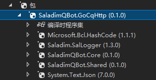

# Saladim.QBot docs

## chap1 新建工程并添加包引用

### .net框架选择

本项目的目标框架为`.net6.0`, `.net7.0`, `.netstandard2.0`, `.netstandard2.1`.
其中最低版本支持即.net标准2.0, 以下内容部分摘自msdn:

>.NET Standard 2.0 提供 37,118 个可用 API 中的 32,638 个。
>
>|.NET 实现|版本支持|
>|-|-|
>|.NET 和.NET Core|2.0, 2.1, 2.2, 3.0, 3.1, 5.0, 6.0, 7.0|
>|.NET Framework|4.6.1 、4.6.2、4.7、4.7.1、4.7.2、4.8、4.8.1|
>|Mono|5.4、6.4|
>|Xamarin.iOS|10.14、12.16|
>|Xamarin.Mac|3.8、5.16|
>|Xamarin.Android|8.0、10.0|
>|通用 Windows 平台|10.0.16299，待定|
>|Unity|2018 年 1 月|

其中最常见的是使用旧版本的`.net framework`, 所以根据表格请务必确认您使用的版本高于4.6.1(根据msdn, 该版本使用.net标准2.0仍有零碎问题, 所以仍建议使用4.7.2级更高版本)

### 安装nuget包

这里有两个方法获取包:

- 编译本项目
- 在github release上下载它

截止目前, 最新的版本是`v0.1.0-alpha`, 但未发布至nuget.org ,你可以到[github release](https://github.com/saladim-org/Saladim.QBot/releases/tag/v0.1.0-alpha)上下载. 注意务必包含`Core`, `Shared`, `GoCqHttp`三个包.

在nuget包管理器上我们选择使用本地包, 并选择`SaladimQBot.GoCqHttp`包进行安装. 如果你遇到了包未找到请确保上述三个包是否位于同目录下.

安装好后依赖树应该大致长这样:  

最后修改: 2022-12-10 17:08:43